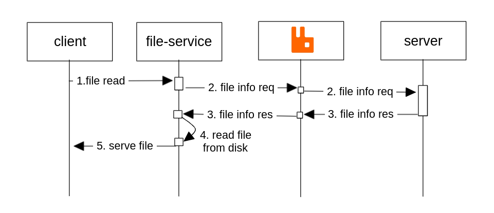

# File serving service
A NestJS backend service to enable file access for users.

## Features
- Authentication & Authorization
- Scalable

## Implementation

### This sequential diagram shows the steps in the implementation required for a file read.

1. A client sends a file read request. This is done via URL.
2. The file service send an 'info' request to the server to receive information like the user access to the file and info about the file.
The request consists of a form of identification of the user (cookie/authorization header, token) and the file (UUID).
3. The alkemio server authenticates the user, finds the document and authorizes it against the user credentials.
4. If the above step is successful sends back the external ID of the file and meta information about it.
5. The file service sends back the file in form of a stream with the appropriate headers.

## Configuration
The current implementation reads the file from the file system.
This requires when ran locally to configure where your local storage folder is located.
By default, it's configured at '../server/.storage' via `DEV_LOCAL_STORAGE_PATH`.
When running on the cloud you need to mount your storage volume to be accessible by the service
and configure the path via `LOCAL_STORAGE_PATH` env variable shared by both server and file service.